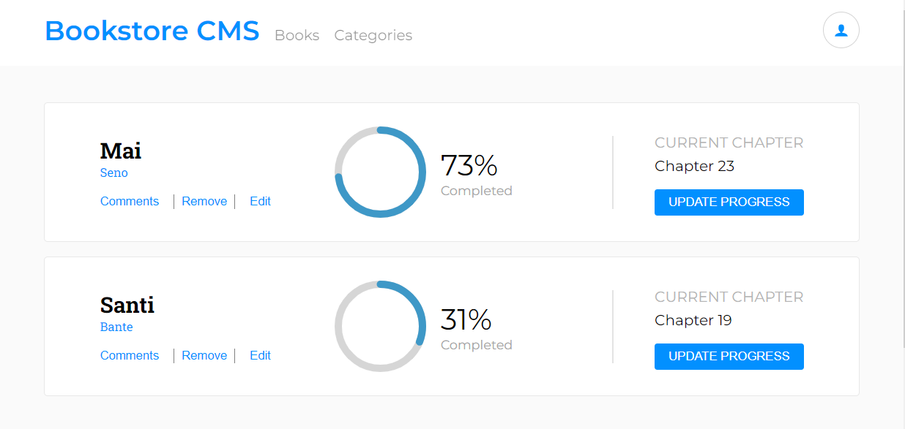

<a name="readme-top"></a>

<div align="center">

  <h3><b>Bookstore</b></h3>

</div>

<!-- TABLE OF CONTENTS -->

# 📗 Table of Contents

- [📖 About the Project](#about-project)
  - [🛠 Built With](#built-with)
    - [Tech Stack](#tech-stack)
    - [Key Features](#key-features)
  - [🚀 Live Demo](#live-demo)
- [💻 Getting Started](#getting-started)
  - [Setup](#setup)
  - [Prerequisites](#prerequisites)
  - [Install](#install)
  - [Usage](#usage)
  - [Run tests](#run-tests)
  - [Deployment](#deployment)
- [👥 Authors](#authors)
- [🔭 Future Features](#future-features)
- [🤝 Contributing](#contributing)
- [⭐️ Show your support](#support)
- [🙏 Acknowledgements](#acknowledgements)
- [❓ FAQ (OPTIONAL)](#faq)
- [📝 License](#license)

<!-- PROJECT DESCRIPTION -->

# 📖 Bookstore <a name="about-project"></a>

  Bookstore is an app that allows you to view a list of books, add a new book and remove a book. Built using React and Redux (state management).

  

## 🛠 Built With <a name="built-with"></a>

### Tech Stack <a name="tech-stack"></a>

<details>
  <summary>Client</summary>
  <ul>
    <li>React</li>
  </ul>
</details>

<details>
  <summary>Server</summary>
  <ul>
    <li>Not Available</li>
  </ul>
</details>

<details>
<summary>Database</summary>
  <ul>
    <li>Not Available</li>
  </ul>
</details>

<!-- Features -->

### Key Features <a name="key-features"></a>

- Project setup with React
- Books page
- Section for adding new book

<p align="right">(<a href="#readme-top">back to top</a>)</p>

<!-- LIVE DEMO -->

## 🚀 Live Demo <a name="live-demo"></a>

[Live Demo](https://rich-bookstore.netlify.app/)

<p align="right">(<a href="#readme-top">back to top</a>)</p>

<!-- GETTING STARTED -->

## 💻 Getting Started <a name="getting-started"></a>

To get a local copy up and running, follow these steps.

### Prerequisites

In order to run this project you need:

- Nodejs
- Node Package Manager
- VS Code text editor

### Setup

Clone this repository to your desired folder:

```sh
  cd my-folder
  git clone git@github.com:ikennarichard/Bookstore.git
```

### Install

Install this project with:

  ```bash
    cd my-project
    npm install
  ```

### Usage

To run the project, execute the following command:
  ```bash
    npm start
  ```

### Run tests

To run tests, run the following command:

- Jest Test
```sh
  npm test
```

- Stylint
```bash 
npx stylelint "**/*.{css,scss}"
```

- Eslint
```bash
  npx eslint "**/*.{js,jsx}"
```

### Deployment

 Not available for now

<p align="right">(<a href="#readme-top">back to top</a>)</p>

<!-- AUTHORS -->

## 👥 Authors <a name="authors"></a>

👤 **Author1**

- GitHub: [ikennarichard](https://github.com/ikennarichard)
- LinkedIn: [Ikenna Oguejiofor](https://linkedin.com/in/ikenna-oguejiofor-38076a237)

<p align="right">(<a href="#readme-top">back to top</a>)</p>

<!-- FUTURE FEATURES -->

## 🔭 Future Features <a name="future-features"></a>

- Improve page UI
- Add user interactions

<p align="right">(<a href="#readme-top">back to top</a>)</p>

<!-- CONTRIBUTING -->

## 🤝 Contributing <a name="contributing"></a>

Contributions, issues, and feature requests are welcome!

Feel free to check the [issues page](https://github.com/ikennarichard/Bookstore/issues).

<p align="right">(<a href="#readme-top">back to top</a>)</p>

<!-- SUPPORT -->

## ⭐️ Show your support <a name="support"></a>

Give a ⭐️ if you like this project!

<p align="right">(<a href="#readme-top">back to top</a>)</p>

<!-- ACKNOWLEDGEMENTS -->

## 🙏 Acknowledgments <a name="acknowledgements"></a>

Hat tip to Microverse team for inspiring this project.

<p align="right">(<a href="#readme-top">back to top</a>)</p>

<!-- LICENSE -->

## 📝 License <a name="license"></a>

This project is [MIT](https://github.com/ikennarichard/Bookstore/blob/dev/LICENSE) licensed.

<p align="right">(<a href="#readme-top">back to top</a>)</p>
